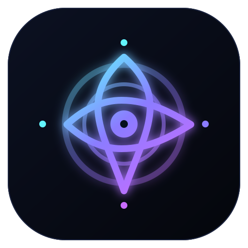

# Cognigenesis

**Private working implementation — Fernando Acosta. All rights reserved. Not approved for public distribution.** See [PRIVATE_RELEASE_POLICY.md](PRIVATE_RELEASE_POLICY.md), [SOURCE_MANIFEST.md](SOURCE_MANIFEST.md), and [PRIVATE_PROVENANCE_INDEX.md](PRIVATE_PROVENANCE_INDEX.md).



**Cognitive operating environment for models, agents, teams, tools, and reasoning scaffolding.**

Cognigenesis is the cognitive architecture. **Cognigenesis Harness** is the runtime substrate underneath it.

The project has entered the **2.0 alpha architecture**: the working v1 terminal/Ollama/ACP paths remain intact while the platform gains semantic events, explicit cognitive state, a shared task graph, typed agent-to-agent communication, and team/swarm primitives.

## What changed in 2.0a1

The platform now contains four explicit layers:

```text
Command Center / Terminal / ACP
             │
             ▼
      Agent Fabric / Teams
             │
             ▼
      Cognitive Architecture
             │
             ▼
        Harness Runtime
             │
             ▼
        Model Substrate
```

New live runtime primitives include:

- semantic `EventBus` for turns, models, tools, policy decisions, failures, and completion
- shared dependency-aware `TaskGraph`
- inspectable `CognitiveLedger` for hypotheses, evidence, contradictions, confidence, and open questions
- typed `AgentMessage` protocol for findings, hypotheses, critiques, decisions, handoffs, and artifacts
- `TeamManager` plus reusable Parallel Search, Adversarial Council, Red/Blue, Specialist Pipeline, and Consensus patterns
- UI-neutral `CommandCenterSnapshot` for the future graphical dashboard and full-screen TUI

The existing execution engine now emits those semantic events directly.

## Terminal

Install/upgrade from the private repo:

```powershell
python -m pip install --user --upgrade --force-reinstall "git+https://github.com/fernandoiacosta/cognigenesis-harness.git"
```

Then:

```text
cogni setup
cogni doctor
cogni harness
```

Inside chat:

```text
/help
/new
/state
/capabilities
/cognition
/tasks
/events
/provider
/workspace
/doctor
/exit
```

The response renderer now uses normal Rich wrapping inside terminal-width panels; long prose should no longer disappear beyond the right edge.

## Teams

Run a bounded multi-agent cognition pattern over the same runtime:

```powershell
cogni team --pattern adversarial-council "Evaluate this architecture and try to falsify its assumptions"
```

Available patterns:

```text
parallel-search
adversarial-council
red-blue
specialist-pipeline
consensus
```

Each agent gets an isolated session while sharing the mission task graph, cognitive ledger, event stream, and team message fabric.

## Command Center

Launch the first graphical Command Center:

```powershell
cogni dashboard --workspace .
```

`cogni command-center --workspace . --open` remains available. Then run `cogni harness --workspace .` or `cogni team ... --workspace .` in another terminal. The dashboard polls the same atomic workspace snapshot and displays:

- cognitive metrics, hypotheses, and evidence
- task graph
- teams and agents
- recent semantic runtime events
- the selected model and provider, without exposing credentials or connection URLs

The dashboard has Overview, Tasks, Agents, Cognition, Activity, and Models views; search and status filters; and a JSON snapshot export. It reads recorded state and does not start agents or edit provider settings. It binds to localhost only because it has no user authentication; use a trusted tunnel for access from another device. The current web dashboard is a UI over the shared state contract, not a separate backend.

## AionUi / ACP

The supported ACP entry point remains:

```text
cogni-acp
```

Generate the exact machine-specific configuration with:

```text
cogni aionui
```

ACP and the terminal share the same execution engine. v2 runtime events are designed so ACP, the future TUI, tracing, and the graphical Command Center consume the same state rather than maintaining parallel implementations.

See [AIONUI.md](AIONUI.md).

## Cognitive architecture

Cognigenesis does **not** claim to expose hidden model chain-of-thought. It externalizes observable reasoning scaffolding:

```text
observation
   ↓
candidate hypotheses
   ↓
mechanisms
   ↓
evidence / contradictions
   ↓
verification
   ↓
confidence update
   ↓
decision / action
```

The goal is to make cognition increasingly architecture-enforced rather than relying only on system-prompt instructions.

## Validation

Controlled evaluation now begins with [Experiment 001](experiments/001/README.md), a pre-registered same-model comparison of the current Cognigenesis control plane against a minimal baseline. The fixed corpus, raw-output runner, deterministic scorer, thresholds, limitations, and integrity rules are committed before the first run. No performance claim should be made until the saved run returns `WIN`, `TIE`, `LOSS`, or `INVALID`.

## Teams and swarm

The harness remains a small per-agent runtime. Team coordination lives above it.

Typed inter-agent objects currently include:

```text
Task
Finding
Hypothesis
Evidence
Question
Critique
Decision
Handoff
Status
Artifact
```

This is the foundation for a Command Center that can visualize not only which agent is active, but **what cognitive work is moving between agents**.

## Current model/provider path

Ollama remains the local-first provider. Model qualification and trust gating remain active; mutation authority is separate from both model capability and user/operator permission.

## Architecture and roadmap

- [Cognigenesis Platform](docs/COGNIGENESIS_PLATFORM.md)
- [Architecture](ARCHITECTURE.md)
- [Roadmap](ROADMAP.md)
- [Security](SECURITY.md)
- [Installation](INSTALL.md)
- [Branding](BRANDING.md)

## Architectural invariant

> The harness is the kernel. Cognigenesis is the cognition layer. Teams, swarm orchestration, and the Command Center grow above them without turning the kernel into a monolith.

## Provider setup

Authorized collaborators can install from the private repository with GitHub CLI access. Review the script before running it:

```sh
gh api repos/fernandoiacosta/cognigenesis-harness/contents/install.sh -H 'Accept: application/vnd.github.raw+json' | sh
```

Choose a provider; API keys are stored in your OS credential manager, or you can set the documented environment variable instead:

```sh
cogni login openai --model gpt-4.1-mini
cogni login anthropic --model claude-sonnet-4-5
cogni login google --model gemini-2.5-flash
cogni login grok --model grok-3-mini
cogni login meta --model YOUR_MODEL --base-url https://YOUR_INFERENCE_HOST/v1/chat/completions
cogni login ollama --model llama3.1:8b --base-url http://192.168.1.20:11434
cogni login litert --model YOUR_IMPORTED_MODEL
```

`cogni harness` starts the interactive runtime (`cogni chat` remains an alias). `cogni login` configures API access. It does not authenticate a ChatGPT/Codex or Claude subscription. OpenAI, Anthropic, Google, xAI, and third-party Meta hosts require their own API key or host credentials. The wizard reuses a saved API key and offers to replace it. Environment overrides: `OPENAI_API_KEY`, `ANTHROPIC_API_KEY`, `GEMINI_API_KEY`, `XAI_API_KEY`, `COGNI_META_API_KEY`. `COGNI_PROVIDER`, `COGNI_MODEL`, `COGNI_OLLAMA_BASE_URL`, and `COGNI_CLOUD_BASE_URL` override saved settings. A single active provider/model is stored; `/switch` in the harness reopens the menu.

Google AI Edge Gallery's official app does not currently offer an external model server. An unmerged community Edge Server PR proposes one. For **on-device Google models today**, import a model into Google's LiteRT-LM CLI and run `litert-lm serve`, then `cogni login litert --model YOUR_IMPORTED_MODEL` (default `http://127.0.0.1:9379`). `cogni login edge --model MODEL --base-url http://PHONE_IP:PORT` targets a server-enabled Gallery build when available. Both local adapters use OpenAI-compatible text chat; tool calling is not available in this integration. Keep LAN inference servers on trusted networks.

For remote Ollama, configure `--base-url` with the Ollama host's reachable address; server-side binding/firewall configuration is required on that machine. `cogni setup --base-url URL` also discovers its installed models.

### Guided first run

Run `cogni setup` in a terminal to open the Cognigenesis setup screens, or `cogni setup --guided` to force them. The installer starts the wizard when attached to a terminal; set `COGNI_SKIP_SETUP=1` to defer it. `cogni harness` opens setup automatically on a fresh terminal install. Existing scripted `cogni setup --model MODEL --base-url URL` remains available for Ollama.

The guided screens select a provider, offer **this device** or **another device on my network** for Ollama, accept an API key or server address, search installed models from Ollama or a local OpenAI-compatible server, or fetch model IDs for a connected OpenAI, Anthropic, Google, or xAI API key, choose a terminal layout, and confirm before saving. If an Ollama server has no reachable models, the wizard reports that and allows an exact model ID; check the server before using the harness. Use `/switch` inside the interactive harness to change provider/model/layout later. API keys go into the operating system credential store; an environment variable is required when no secure keyring backend is present. ChatGPT/Codex and Claude subscription OAuth are not available through this integration. If a provider model-list request fails, a suggested ID and an exact-ID entry remain available; the catalog does not guarantee that every listed model supports chat or tools.
